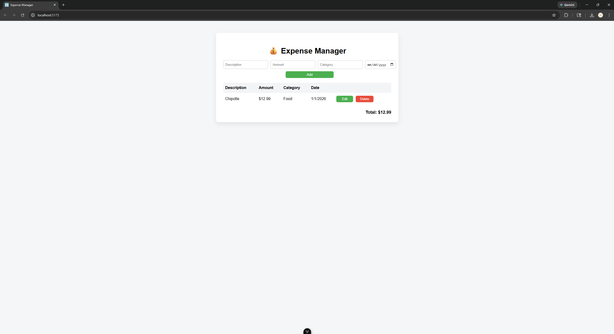
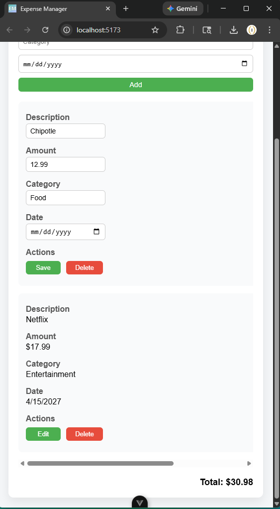
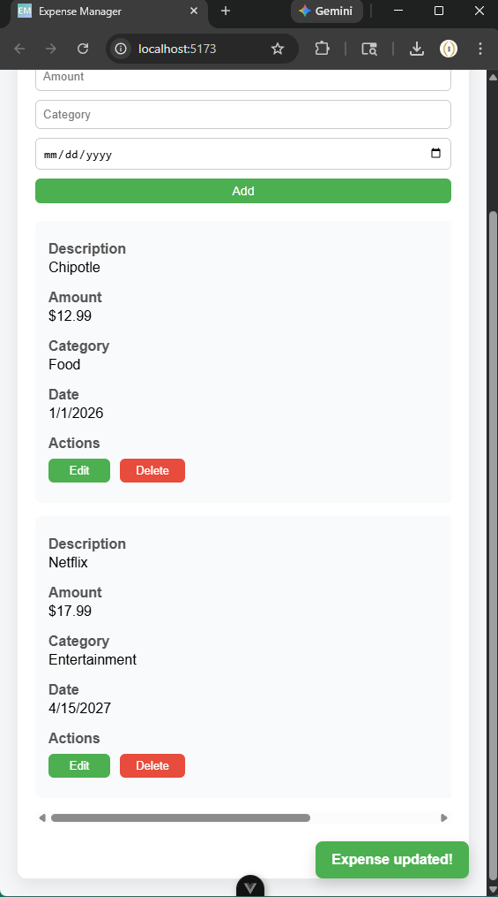

# 💰 Expense Manager

A full-stack Vibe Coding expense tracking application built with React (Vite) and .NET Web API.

- ⚡ ASP.NET Core Web API
- 🎨 Vue 3 (Composition API)
- 🌐 RESTful architecture
- 📦 Environment-based configuration
- 📱 Fully responsive UI

---

## 🚀 Features

- Create, Read, Update, Delete expenses
- Category + Date tracking
- Real-time total calculation
- Toast notifications
- Responsive design (mobile + desktop)
- Environment variable API configuration

---

## 🛠️ Tech Stack

### Backend
- ASP.NET Core
- Entity Framework Core
- SQLite

### Frontend
- Vue 3 (Vite)
- Composition API
- CSS Grid + Flexbox

---

## 📸 Screenshots

### Desktop


### Mobile


### Mobile Toast


---

## 🛠 Installation & Setup

### 1️⃣ Clone the repo

```bash
git clone https://github.com/YOUR_USERNAME/expense-manager.git
cd expense-manager
```

### 2️⃣ Backend Setup

```bash
cd ExpenseManagerAPI
dotnet run
```

Swagger will be available at: https://localhost:5246/swagger

### 🗄 Database Setup

From inside the backend folder:

```bash
dotnet ef database update
```

### 3️⃣ Frontend Setup

```bash
cd expense-manager-frontend
npm install
npm run dev
```

Runs on: http://localhost:5173

### 🔐 Environment Variable

Create a .env file inside the frontend folder:

VITE_API_URL=http://localhost:5246/api/expense

---

### 🌎 Possible Future Improvements
- Authentication
- Deployment
- Filtering & sorting
- Export to CSV
